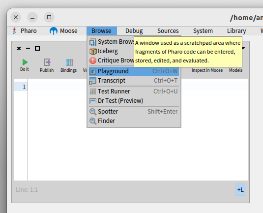
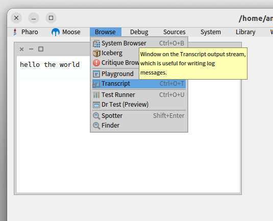

<!-- headingDivider: 1 -->
<!-- paginate: true -->
<!-- footer: "Pharo -- Environment d'exécution" -->

# Pharo -- Environnement d'exécution

- Playground
- Transcript
- Inspector

# Environnement d'exécution



- Playground
  - "Live environment"
  - Une "console" pour manipuler des objets
- ex : "Print it" (ctrl-P) sur
  ```
  #( 6 45 36 8 3 ) median
  ```

# Environnement d'exécution



- Transcript
  - Affichage de traces
```
'hello' trace.
Character space trace.
'the world' tarceCr.
```

# Environnement d'exécution

- Que fait ?
```
| rnd |
rnd := Random new.
5 timesRepeat: [ (rnd nextIntegerBetween: 1 and: 50) asString traceCr ]
```

# Exercices sur les collections

À faire dans un Playground:

- Trouver la superclasse des DTOs : `BLLazyServerPojo`
- Trouver tous les DTOs (sous-classes de `BLLazyServerPojo`)
- Éliminer les sous-classes abstraites de `BLLazyServerPojo`
- Trouver les sous-classes de `BLLazyServerPojo` dont le nom commence par 'Abstract'

# Exercices sur les collections (suite)

- Trouver toutes les sous-classes de `UserTypeEnumAbstract`
- Trouver les sous-classes de `UserTypeEnumAbstract` dont le nom ne commence pas par 'Enum'
- Trouver les sous-classes de `BLLazyServerPojo` dont le nom ne contient pas 'Abstract', 'DTO', ou 'Enum'
- Trouver les classes dont le nom contient 'DTO' qui n'heritent pas de `BLLazyServerPojo` (ex: `ProductDTO`)

