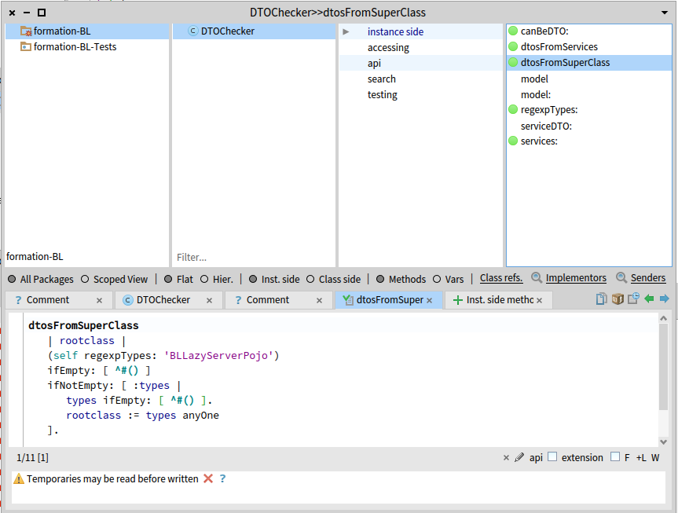
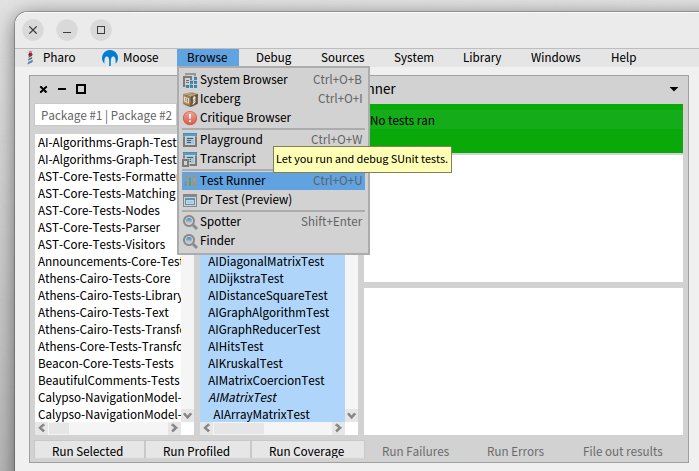

<!-- headingDivider: 1 -->
<!-- paginate: true -->
<!-- footer: "Pharo -- L'IDE" -->


# Pharo -- L'IDE

- SystemBrowser (Édition de code)
- Iceberg (gestion de version GIT)
- TestRunner (Tests unitaires)

# Application

Exercice pratique mélant les trois outils (édition de code, gestion de version, tests unitaires).

Créer une classe pour automatiser la recherche de DTOs :
- à partir de leur super-classe (`BLLazyServerPojo`)
v. exercices à la fin de [Pharo -- Environnement d'exécution](./execPharo.html)
-  a partir des types des paramètres des services


# SystemBrowser



# Iceberg

- Interface utilisateur pour GIT (Connait  GitHub et GitLab)
- Interface aux actions courantes (Push, Pull, Fetch, Commit)
- Gestion des branches (création, checkout, merge)
- Gestion des "*remotes*"
- etc.

# Iceberg

- Documentation dans le MOOC Pharo ([https://mooc.pharo.org/](https://mooc.pharo.org/))
- MOOC, semaine 1, Redo 4
[http://rmod-pharo-mooc.lille.inria.fr/MOOC/PharoMOOC-Videos/FR/Week1/W1-Redo4-FR-final.mp4](http://rmod-pharo-mooc.lille.inria.fr/MOOC/PharoMOOC-Videos/FR/Week1/W1-Redo4-FR-final.mp4)
- MOOC, semaine 4, Live A
[http://rmod-pharo-mooc.lille.inria.fr/MOOC/PharoMOOC-Videos/FR/Week4/W4-LiveA-FR-final.mp4](http://rmod-pharo-mooc.lille.inria.fr/MOOC/PharoMOOC-Videos/FR/Week4/W4-LiveA-FR-final.mp4)
- MOOC, semaine 4, Live B
[http://rmod-pharo-mooc.lille.inria.fr/MOOC/PharoMOOC-Videos/FR/Week4/W4-LiveB-FR-final.mp4](http://rmod-pharo-mooc.lille.inria.fr/MOOC/PharoMOOC-Videos/FR/Week4/W4-LiveA-FR-final.mp4)

# *Test Runner*

- 3 outils
  - TestRunner (outil historique)
  - Dr Test (outil plus récent)
  - Dans le *SystemBrowser* (convention de nomage)

# *Test Runner*




# Exercice -- Initialisation Pharo

Créer une classe pour automatiser la recherche de DTOs

- Dans Pharo (SystemBrowser), créer un package `formation-BL`
- créer une classe `DTOChecker`
  - lui donner une variable d'instance `model`
  - créer les accesseurs

# Exercice -- Initialisation GIT

- créer un projet dans Iceberg
    - ajouter le package `formation-BL` dans ce projet
    - faire un commit
- créer un projet dans GitHub (ou GitLab)
- ajouter l'URL au projet Iceberg
- faire un push
  - attention au nom de la branche par defaut (`master` vs. `main`)

# Exercices -- Initialisation TDD

- créer la classe de test `DTOCheckerTest`
  - Clique droit sur `DTOChecker` puis "*Jump to test class*"
  - Clique droit sur `DTOChecker` puis "*New test class*"
  - Dans le SystemBrowser comme une classe normale
- Suggestion :
```St
setUp
  super setUp.
	
  model := FamixJavaModel new.
  checker := DTOChecker new model: model ; yourself
```

# Exercice


**Exercices à faire en TDD**

- créer une méthode `#regexpTypes: <regexp>` pour rechercher les types dont le nom matche la regexp
    - faire un commit
- créer une méthode `#dtosFromSuperclass` pour trouver les classes qui heritent de `BLLazyServerPojo` et dont le nom ne contient pas 'Enum'
    -  faire un commit

# Exercice

- créer une méthode `#serviceDTO:` qui recoit une `FamixJavaMethod` et retourne les types de ses paramètres et son type de retour qui ne sont pas des types Java
    - Note: la création d'une méthode utilitaire `#canBeDTOS:` peut être une bonne idée
    - faire un commit
- créer une méthode `#services:` qui recherche les méthodes d'une classe pouvant être des services (publique, pas constructeur, pas `<Initializer>`)
    - faire un commit

# Exercice

- créer une méthode `#dtosFromServices` pour trouver les DTOs en parmètre des services des classes dont lenom commence par 'Uc'
    - faire un commit

Étape supplémentaire comparer les résultats de  `#dtosFromSuperclass` et `#dtosFromServices` sur le modèle *Omaje*

# *Cheat Sheet* -- Pharo

- Regexp matching: `<string> asRegex matches: <string>`
- Les classes de test héritent de `TestCase`
- Les méthodes de test ont un nom: `test...`
- Les méthodes de setup s'appellent: `setUp`
- Principales assertions : `#assert:equals:`, `#assert:`, `#deny:`
- Méthodes sur les collections : `#flatCollect:`, `#flatCollectAsSet:`

# *Cheat Sheet* -- Moose/Famix

- Création d'un modèle Java : `FamixJavaModel new`
- Création d'une entité dans un modèle : `FamixJavaClass new mooseModel: <model>`
- Classe d'une méthode Java : `#parentType`, `#parentType:`,
- Paramètres d'une méthode: `#parameters` (opposé: `#parentBehaviouralEntity`)
- Type déclaré d'une méthode/d'un paramètre: `#declaredType`
- Les entités qui sont utilisées mais pas définies dans un projet (ex. `java.lang.System`) ont une propriété `#isStub` vraie
